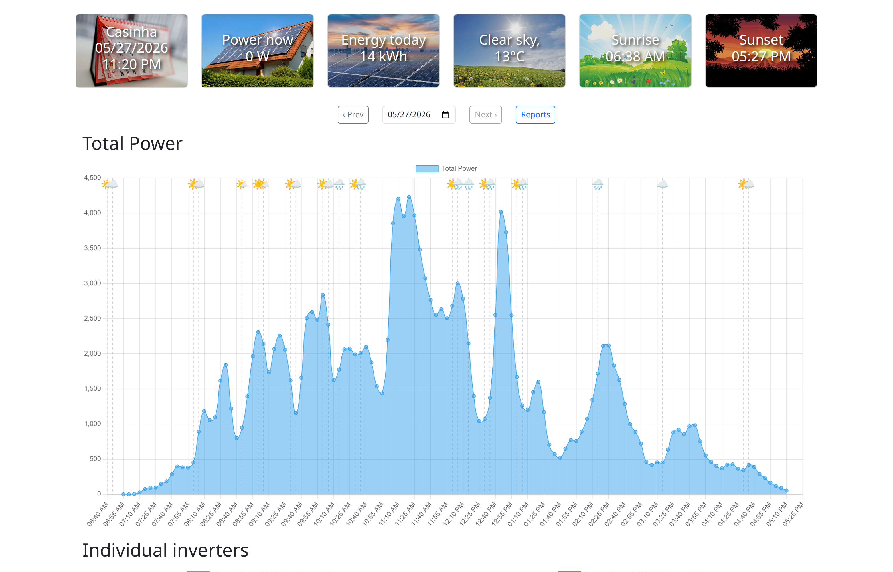
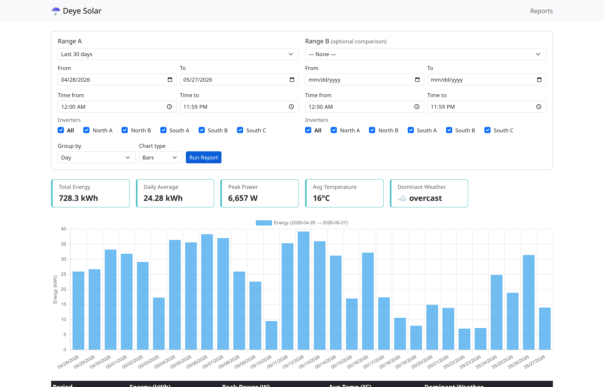

# Deye Local Api and Dashboard

A local RESTFul API (and a Dashboard) to access Deye Micro Inverter Data

## Context

Deye Micro-inverters are devices used to inject on the electric grid the power produced by solar panels.

These micro-inverters have a network connection, and one can use the "Solarman" app on the phone to monitor the power plant stats. However, the data inside the app cannot be accessed by 3rd-party apps (or by custom apps).

## Purpose of this project

Create a local data repository, so you can both get instant data straight from the inverters, and also to store this data on a local database to use however you like.

This project alone will not remove the requirement of the micro-inverter be connected to the internet, hence, will not improve your privacy in any way. It will just allow you to have access to a clean copy of your stats data.

If privacy is a concern for you, then you should check out the "[Deye Microinverter Cloud-free](https://github.com/Hypfer/deye-microinverter-cloud-free)" project.

## Current status of this project

This is what is already working:

- [x] Provide a standard RESTFul API to get data from Deye Micro-inverters over local network
- [x] Store data from the micro-inverters to a database, so the data can be used to create useful reports
- [x] Create a Dashboard to present the powerplant data
  - [x] Navigate to any previous date using prev/next buttons or a date picker
  - [x] Weather condition change indicators overlaid on the power chart (emoji + dashed line at each transition)
- [x] Send a daily report to a Telegram Group (using a Telegram Bot)
- [x] Multi-language UI (English, Brazilian Portuguese, Spanish) — language is stored system-wide and switchable from a footer dropdown on every page


## How to set up

### Option 1: Docker Compose (Recommended)

1. Get a Linux machine running on the local network
2. Install [Docker](https://docs.docker.com/get-docker/) and [Docker Compose](https://docs.docker.com/compose/install/)
3. Clone this repository and enter the directory
4. Run `docker compose up -d`
5. Open `http://localhost:8080/admin/` in your browser
6. The setup wizard will guide you through:
   - Creating an admin account
   - Configuring your power plant settings (name, timezone, location)
   - Adding your inverters (IP address, credentials)
   - Optionally setting up Telegram daily reports

The database is automatically configured via environment variables in `docker-compose.yml`. Data collection runs every 5 minutes via the built-in cron service.

### Option 2: Manual Installation

1. Get a Linux machine running on the local network
2. Install PostgreSQL, Apache, PHP (with `php-pgsql` and `php-curl` extensions)
3. Set up a new user and a new database on PostgreSQL
4. Create a new directory called `deye_api` inside an Apache exposed directory (usually `/var/www/html/`)
5. Copy all the files of this repository to that directory
6. Open `http://localhost/deye_api/admin/` in your browser
7. The setup wizard will guide you through database connection, admin account creation, and all other settings
8. Add a cron job to run the `crontasks.php` file every 5 minutes (run `crontab -e` and add `*/5 * * * * php /var/www/html/deye_api/crontasks.php`)

## How to use

There are three ways to use: the Dashboard, the Reports page, and the API:

### Dashboard
Open an Internet Browser and open `http://localhost/deye_api/`



### Reports
Open `http://localhost/deye_api/reports.html` for the report builder.

The reports page lets you analyse historical production data with flexible grouping and comparison:

- **Two date ranges (A and B):** run a single range for totals, or add a second range to compare periods side-by-side (e.g. this month vs last month, or this summer vs last summer)
- **Per-range time-of-day filter:** narrow each range to a specific window (e.g. Range A = 08:00–12:00, Range B = 12:00–18:00) to compare morning and afternoon production
- **Group by:** Hour (aggregated by hour-of-day across the range), Morning and Afternoon (two buckets: before/after noon), Day, Week, or Month
- **Chart types:** Bars, Lines, or Doughnut
- **Inverter selection:** when multiple inverters are configured, choose which ones to include per range
- **Summary cards:** total energy, daily average, peak power, average temperature, and dominant weather condition — with percentage deltas when comparing two ranges



### API
Open an Internet Browser and open `http://localhost/deye_api/deye.php?user=admin&password=admin&ipaddress=192.168.15.201`

Replace on the above URL the parameters with your inverter specific details.

If you plan to use only the API, you don't need to run the setup wizard, and you don't need a database.

#### Data Structure example

```
{
"inverter_sn": "1234567890",
"power_now": 725,
"power_today": 1,
"power_total": 1612.6,
"device_sn": "0987654321",
"device_ver": "MW3_16U_5406_1.63",
"timestamp": "2025-08-20T13:04:45Z",
"ipaddress": "192.168.15.201"
}
```

## How it works

Every Deye Microinverter has a web interface, that can be accessed by opening the browser and acessing the IP Address of the inverter by http (the default username and password are both `admin`).

Example:


If you open the Network console of the browser, you'll notice that this page gets data from another page from the inverter: The `status.html` file.


So, by parsing the contents of this file, we can get the stats directly from the inverter.

This program does exactly that: Parses the `status.html` file and get the following information:
* Device Serial Number
* Inverter Serial Number
* Device Firmware Version
* Power being generated now (in Watts)
* Energy produced today (in Kilowatts-Hour)
* Energy produced in total (in Kilowatts-Hour)

## Project requirements
* Backend uses only vanilla PHP and PostgreSQL (no frameworks, no Composer)
* UI uses [Bootstrap](https://github.com/twbs/bootstrap) and [Chart.js](https://github.com/chartjs/Chart.js) libraries only
* No fancy frameworks to bloat the application. No package managers, nothing. Just plain HTML, JavaScript, and PHP. This project is intended to be simple.

## Development roadmap
Here's a list of new features I wish to add to this project in the future:

- [ ] Get data from individual PV inputs (each individual solar panel of each micro-inverter) 
  - Voltage (V)
  - Current (A)
  - Power (W)
  - Energy Today (kWh)
  - Energy Total (kWh)
- [ ] Get Inverter Temperature (Celsius)
- [x] Get Weather Data (ambient temperature, humidity, wind speed and direction, condition like clear, cloudy, raining, snowing, etc)
- [x] Show weather condition changes as emoji icons on the power chart
- [x] Configuration UI (admin panel with setup wizard, settings management, and inverter CRUD)
- [x] Make it work as a Docker compose package, to make set up easier for everyone
- [x] Support Dark mode
- [x] Allow user to navigate to previous dates on the dashboard (currently only shows current day)
- [x] Report builder
  - [x] Filter by arbitrary date ranges
  - [x] Group/aggregate by hour-of-day, morning/afternoon, day, week, month
  - [x] Cross-reference production data with weather data
  - [x] Summary statistics (totals, averages, peaks)
  - [x] Compare two date ranges side-by-side with delta indicators
  - [x] Per-range time-of-day filters and inverter selection
  - [x] Multiple chart types: bars, lines, doughnut
- [x] Multi-language support (English, Português Brasileiro, Español)
  - Language stored in the database, applies system-wide
  - Switchable via a dropdown in the footer of every page
  - Easily extensible: add `lang/xx.json` and one line in `i18n.js`
