# Deye Local API and Dashboard — User Manual

## Table of Contents

1. [Introduction](#1-introduction)
2. [Prerequisites](#2-prerequisites)
3. [Pre-Installation Preparations](#3-pre-installation-preparations)
4. [Installation](#4-installation)
5. [Admin Panel](#5-admin-panel)
6. [Dashboard](#6-dashboard)
7. [Reports](#7-reports)
8. [Notifications and Daily Reports](#8-notifications-and-daily-reports)
9. [Understanding Your Data](#9-understanding-your-data)
10. [Backup and Restore](#10-backup-and-restore)
11. [Updating](#11-updating)
12. [Troubleshooting](#12-troubleshooting)
13. [API Reference](#13-api-reference)

---

## 1. Introduction

### 1.1 What this project does

Deye Local API and Dashboard is a self-hosted application that collects real-time production data directly from your Deye micro-inverters over your local network, stores it in a database, and presents it through a web dashboard and a reporting interface.

Every five minutes, the application polls each configured inverter — using the SolarmanV5/Modbus protocol over TCP port 8899 where available, or an HTTP fallback — and records the results in a local PostgreSQL database. From there you can:

- **View the dashboard** — a live chart showing your plant's power output throughout the day, with per-inverter breakdowns and weather condition overlays
- **Navigate history** — browse any past date and see exactly how your plant performed
- **Analyse production** — the Reports page lets you aggregate data by hour, day, week, month, or season, compare any two periods side by side, and filter by time of day or individual inverter
- **Receive daily summaries** — an optional Telegram integration sends a production chart and energy total to a chat or group at sunset every day
- **Query the data programmatically** — a set of JSON API endpoints lets you read live and historical data from any other application on your network

### 1.2 Why it exists

Deye micro-inverters ship with a mobile app (Solarman) that provides basic monitoring. However, the official app connects through Solarman's cloud infrastructure — it does not expose your data to third-party applications or local integrations, and there is no supported way to query it from your own tools.

This project talks directly to the inverter over your local Wi-Fi using the same SolarmanV5 protocol the logging stick uses internally. No cloud account is required for data collection, and everything runs on hardware you control.

### 1.3 What it does not do

This project does **not** disconnect the inverter from the Solarman cloud. The inverter continues to maintain its normal cloud connection independently. This means the official Solarman app continues to work alongside this project without any conflict.

Because the cloud connection is not removed, this project does **not** improve the privacy of your inverter's communication with Solarman's servers. If that is a concern, see the [Deye Microinverter Cloud-free](https://github.com/Hypfer/deye-microinverter-cloud-free) project, which takes a different approach.

### 1.4 Who it is for

This project is intended for anyone with a Solarman-compatible Deye micro-inverter who wants to:

- Keep a local copy of their production data independent of any cloud service
- Build custom dashboards, automations, or integrations using a local JSON API
- Analyse production patterns across seasons or years
- Receive daily Telegram reports without relying on third-party apps

It is designed to run on a Raspberry Pi or any always-on Linux machine. Basic familiarity with Docker and the command line is needed for the initial setup; day-to-day use requires no technical knowledge.

---

## 2. Prerequisites

Before installing, make sure you have everything listed in this section. Trying to proceed without one of these items will either prevent installation or cause the system to collect no data.

### 2.1 A compatible inverter

Your inverter must be a Solarman-compatible Deye micro-inverter with Wi-Fi connectivity. Depending on the model, Wi-Fi is either built into the inverter or provided by an external logging stick (a small module that plugs into the inverter). Either way, the inverter must be connected to your local Wi-Fi network and have an IP address reachable from the host machine.

The following models have been tested or are expected to work:

| Model | Status |
|-------|--------|
| SUN-M225G4-EU-Q0 | Confirmed |
| SUN-M80G4-EU-Q0 | Likely compatible |
| SUN600G3-EU-230 | Likely compatible |
| SUN-M80G3-EU-Q0 | Likely compatible |

For the full compatibility list, including notes on which features are available per model, see [COMPATIBILITY.md](COMPATIBILITY.md).

### 2.2 A host machine

You need a machine that stays on continuously (or at least during daylight hours) to run the software and collect data every 5 minutes. Any of the following work well:

- **Raspberry Pi** (model 3B or newer recommended) running Raspberry Pi OS
- **A Linux mini-PC or home server** running Ubuntu, Debian, or any other Linux distribution that supports Docker
- **A NAS** with Docker support (Synology, QNAP, etc.)
- **Any x86 or ARM Linux machine** on your local network

The application is lightweight. A Raspberry Pi 3B with 1 GB of RAM is sufficient regardless of how many inverters you have — polling each inverter and saving its data takes under a second, so the load scales negligibly. The main thing to plan for is storage: the database grows over time, so make sure the host machine has adequate disk space for long-term data retention.

> **Windows / macOS:** Not officially supported for production use. Docker Desktop on Windows or macOS may work for testing but is not recommended for an always-on deployment.

### 2.3 Required software on the host machine

The following software must be installed on the host machine before you begin:

**Docker Engine**
Docker is the container runtime that runs all application services. Install it from the official Docker documentation for your operating system:
- Ubuntu / Debian: https://docs.docker.com/engine/install/ubuntu/
- Raspberry Pi OS: https://docs.docker.com/engine/install/raspberry-pi-os/

Verify the installation:
```bash
docker --version
```

**Docker Compose**
Docker Compose is included with Docker Desktop and with recent Docker Engine installations (as the `docker compose` plugin). Verify it is available:
```bash
docker compose version
```

If the command is not found, install the Compose plugin by following the instructions at https://docs.docker.com/compose/install/linux/.

**Git**
Git is used to download the project and to apply future updates.
```bash
git --version
```

If Git is not installed:
```bash
# Debian / Ubuntu / Raspberry Pi OS
sudo apt install git
```

### 2.4 Network requirements

The host machine and the inverters must all be on the same local network (or at least able to reach each other by IP address). The application communicates with each inverter in two ways:

| Protocol | Port | Used for |
|----------|------|---------|
| TCP | 8899 | SolarmanV5/Modbus — primary polling method; provides full data including temperature and per-panel stats |
| HTTP | 80 | `status.html` web interface — fallback polling method and serial number resolution during setup |

If your router uses network isolation (e.g. a guest Wi-Fi that cannot reach the LAN), the inverters and the host machine must be on the same VLAN or segment.

No inbound ports need to be opened on the host machine unless you want to access the dashboard from outside your local network.

### 2.5 Inverter credentials

The inverter web interface (HTTP port 80) is protected by HTTP Basic Auth. The factory default credentials are:

- **Username:** `admin`
- **Password:** `admin`

If these have been changed, you will need the current credentials during setup. You can verify them by opening `http://<inverter-ip>/` in a browser on the same network.

> *[Screenshot needed: browser showing the inverter's HTTP Basic Auth login prompt]*

> *[Screenshot needed: inverter's web status page after login, showing device serial number and current power output]*

### 2.6 Internet access on the host machine (optional but recommended)

The host machine needs outbound internet access for two optional features:

- **Weather data** — fetched from the Open-Meteo API (no account or API key required)
- **Telegram daily reports** — sent via the Telegram Bot API

Data collection from the inverters themselves works entirely on the local network with no internet access required.

---

## 3. Pre-Installation Preparations

Complete these steps before running the installer. None of them require touching the application itself — they are about getting your network and optional services into the right state so that installation goes smoothly.

### 3.1 Find your inverter's IP address

The application needs the IP address of each inverter. The easiest ways to find it:

**From your router's admin panel**
Log in to your router (typically at `http://192.168.1.1` or `http://192.168.0.1`) and look for a section called "Connected devices", "DHCP clients", or "LAN clients". Look for a device whose name contains "DEYE", "SOLAR", or "SolarmanWiFi". The IP address listed there is your inverter's current address.

> *[Screenshot needed: router admin panel showing the DHCP client list with the inverter device highlighted]*

**From the Solarman app**
Open the Solarman app on your phone, go to your device settings, and look for a "Local connection" or network info section. Some app versions display the inverter's local IP address directly.

**With a network scanner**
If the above methods don't work, you can scan your local network from a terminal on the host machine:
```bash
# Install nmap if needed
sudo apt install nmap

# Replace with your local subnet (check with: ip route)
sudo nmap -sn 192.168.1.0/24
```
Look for hosts with a hostname or MAC address vendor matching "Espressif" — this is the Wi-Fi chip manufacturer used in Deye inverters.

### 3.2 Reserve a static IP for each inverter

By default, your router assigns IP addresses dynamically (DHCP), which means an inverter's IP address can change after a reboot or router restart. Since you will enter the inverter IP address into the application's configuration, it must stay the same.

The recommended approach is a **DHCP reservation** (also called a static lease): you tell the router to always assign the same IP to a device based on its MAC address. This is safer than setting a static IP on the inverter itself, as it keeps all network configuration in one place.

To set a DHCP reservation:
1. Log in to your router's admin panel
2. Find the connected device list and locate each inverter by name or MAC address
3. Look for an option like "Reserve IP", "Static lease", or "Bind IP to MAC"
4. Assign an IP address outside the router's automatic DHCP range to avoid conflicts
5. Save and, if required, reboot the router

Repeat for each inverter.

> *[Screenshot needed: router admin panel showing a DHCP reservation entry for an inverter, with MAC address and assigned IP]*

### 3.3 Verify the inverter is reachable

Before installing, confirm that the host machine can reach each inverter. Run the following from the host machine's terminal, replacing the IP with your inverter's address:

```bash
ping -c 4 192.168.1.100
```

If the ping succeeds, also confirm the web interface is accessible:

```bash
curl -u admin:admin http://192.168.1.100/status.html
```

You should see a response containing HTML with inverter data. If you get a connection error, check that the host machine and the inverter are on the same network segment and that no firewall is blocking port 80.

> **Tip:** If you changed the default credentials on your inverter, substitute them in the `curl` command above.

### 3.4 Note down the inverter credentials

During setup you will be asked for each inverter's username and password. The factory default for all Deye micro-inverters is:

- **Username:** `admin`
- **Password:** `admin`

If you have changed these, make sure you have the current credentials on hand before starting the installation.

### 3.5 Set up a Telegram bot (optional)

This step is only needed if you want to receive a daily report with a production chart sent to Telegram. You can skip it now and configure Telegram later from the admin panel.

**Step 1 — Create the bot**

1. Open Telegram and search for `@BotFather`
2. Start a chat and send the command `/newbot`
3. Follow the prompts: choose a display name (e.g. "My Solar Plant") and a username ending in `bot` (e.g. `mysolarpowerbot`)
4. BotFather will reply with a **bot token** — a string that looks like `123456789:ABCdefGhIJKlmNoPQRsTUVwxyZ`. Copy it and keep it safe.

> *[Screenshot needed: Telegram conversation with BotFather showing the /newbot flow and the bot token message]*

Once you have the bot token, that is all you need for now. The admin panel has a built-in tool to help you find the chat ID after installation.

### 3.6 Choose a port for the dashboard (optional)

The dashboard runs on port **8080** by default. If that port is already in use on your host machine, you can change it before starting the stack by editing the `docker-compose.yml` file:

```yaml
ports:
  - "8080:80"   # Change the first number to any free port, e.g. "9090:80"
```

If you are not sure whether port 8080 is free, check with:
```bash
ss -tlnp | grep 8080
```

No output means the port is available.

---

## 4. Installation

### 4.1 Clone the repository

On the host machine, open a terminal and run:

```bash
git clone https://github.com/danarrib/Deye-Local-Api-and-Dashboard.git
cd Deye-Local-Api-and-Dashboard
```

This downloads the project into a directory called `Deye-Local-Api-and-Dashboard` and enters it. All subsequent commands should be run from inside this directory.

### 4.2 Start the stack

```bash
docker compose up -d
```

Docker will pull the required base images (PHP/Apache, PostgreSQL) and start three containers:

| Container | Role | Default port |
|-----------|------|-------------|
| `deye_php` | Web server (dashboard, API, admin panel) | 8080 |
| `deye_db` | PostgreSQL database | 5442 (host only) |
| `deye_cron` | Data collection and daily reports (runs every 5 min) | — |

On first run, the database schema is created automatically. This takes a few seconds. You can verify all containers are running with:

```bash
docker compose ps
```

All three should show a status of `running` (or `Up`).

> *[Screenshot needed: terminal output of `docker compose ps` showing all three containers running]*

### 4.3 Open the admin panel

Open a browser on any machine on your local network and go to:

```
http://<host-ip>:8080/admin/
```

Replace `<host-ip>` with the IP address of the machine running Docker. If you are sitting at that machine, you can use `http://localhost:8080/admin/`.

The setup wizard will guide you through the remaining configuration steps described in the next section.

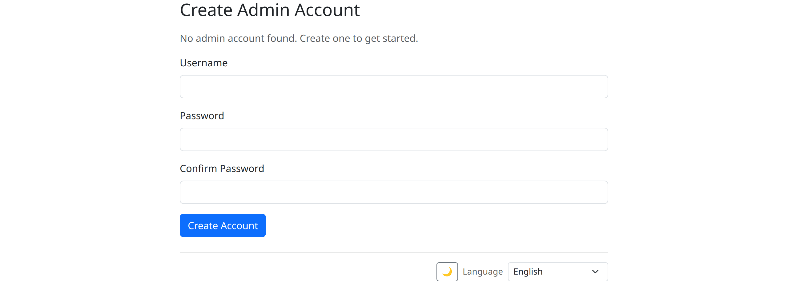

> **Tip:** To find the host machine's IP address, run `ip addr show` (Linux) and look for the `inet` address on your network interface (commonly `eth0` or `wlan0`).

---

## 5. Admin Panel

The admin panel is available at `http://<host-ip>:8080/admin/`. On first access, the setup wizard walks you through the required configuration in order. On subsequent visits, it goes straight to the login screen.

### 5.1 First-time setup wizard

The wizard runs automatically the first time and presents three steps in sequence.

**Step 1 — Create an admin account**

Choose a username and password for the admin panel. There are no restrictions on the username. The password must be at least 6 characters. These credentials are only used to log in to the admin panel — they are separate from the inverter credentials.


**Step 2 — Power plant settings**

| Field | Description |
|-------|-------------|
| Power Plant Name | A friendly name shown in the dashboard header (e.g. "Home Solar") |
| Timezone | Your local timezone. The dropdown is pre-filled with your browser's timezone — verify it is correct. |
| Latitude / Longitude | Your location, used to calculate sunrise and sunset times for the daily Telegram report. Click **Detect Location** to fill these automatically from your browser. |

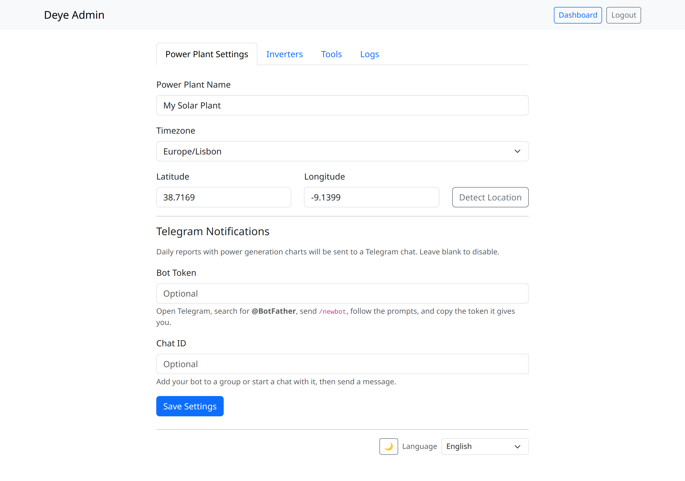

**Step 3 — Telegram notifications (optional)**

Enter the bot token you obtained from BotFather in section 3.5. Once the token is entered, two buttons appear:

- **Detect Chat ID** — sends a request to the Telegram API to find which chats have recently messaged the bot, and fills the Chat ID field automatically. Before clicking this button, make sure you have sent at least one message to the bot (or to the group where the bot is a member) so Telegram has a pending update for the bot to receive.
- **Send Test Message** — sends a test message to the configured chat to verify that both the token and chat ID are correct.

Leave both fields blank to skip Telegram for now. You can configure it later from the Settings tab.

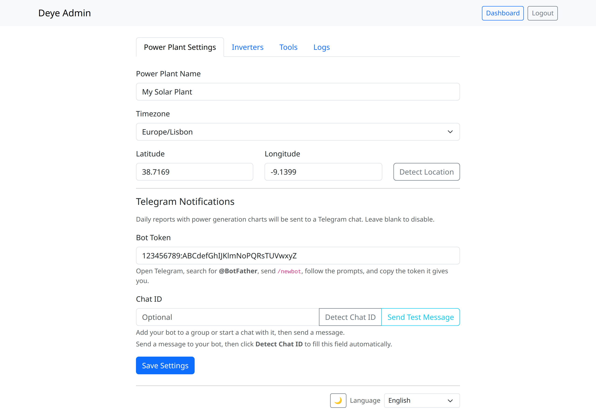

### 5.2 Logging in

After the wizard completes, the panel shows a login screen on every subsequent visit. Enter the username and password created in Step 1. The session is stored in your browser's local storage and does not expire automatically — use the **Logout** button in the top navigation bar to end it.

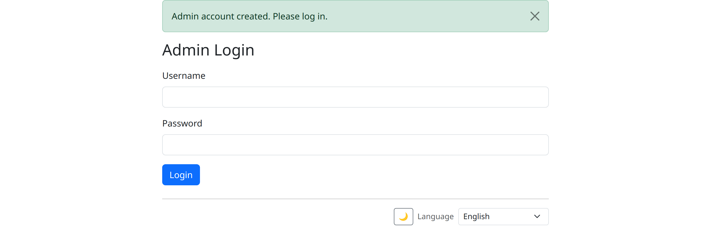

### 5.3 Power Plant Settings tab

The Settings tab lets you update all plant-level configuration at any time:

- **Power Plant Name, Timezone, Latitude, Longitude** — same fields as the wizard; the **Detect Location** button is available here too.
- **Telegram Notifications** — update the bot token and chat ID, or clear them to disable reports. The **Detect Chat ID** and **Send Test Message** buttons work the same way as in the wizard.

Click **Save Settings** to apply changes. Settings take effect immediately for the dashboard and API; the next cron run will use the updated Telegram configuration.

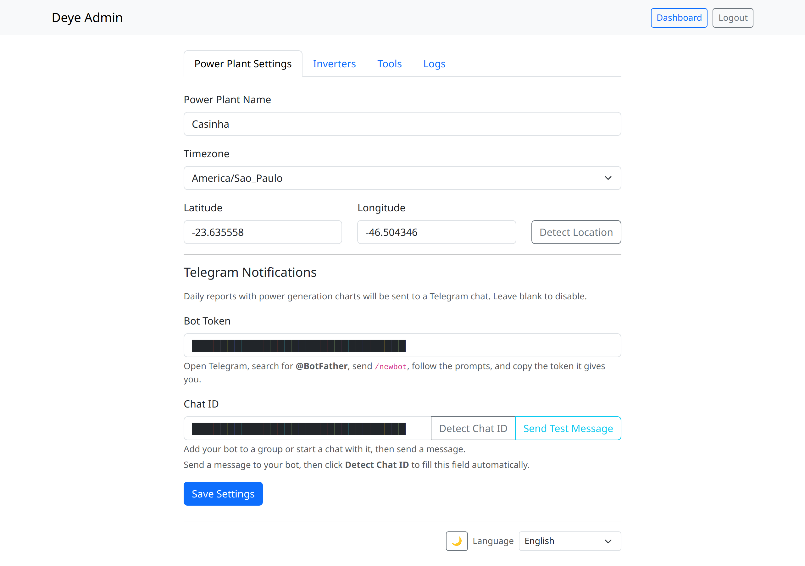

### 5.4 Inverters tab

The Inverters tab lists all configured inverters and lets you add, edit, or remove them.

**Adding an inverter**

Click **Add Inverter** and fill in the form:

| Field | Description |
|-------|-------------|
| Friendly Name | A label for this inverter shown in the dashboard (e.g. "Rooftop East") |
| IP Address / Hostname | The static IP you reserved in section 3.2 |
| Username | Inverter web interface username (default: `admin`) |
| Password | Inverter web interface password (default: `admin`) |

Click **Test Connection** to verify the inverter is reachable before saving. The test fetches `status.html` over HTTP and reports the device serial number if successful.

When you click **Save**, the system automatically:
1. Fetches `status.html` to resolve the logger serial number
2. Attempts a TCP connection to port 8899 to check whether SolarmanV5 is available
3. Sets the `SolarmanV5` flag accordingly — no manual configuration is needed

After saving, the inverter card shows a **SolarmanV5** badge (green) or a **HTTP only** badge (grey) indicating which polling method will be used. SolarmanV5 provides richer data including inverter temperature and per-panel stats.

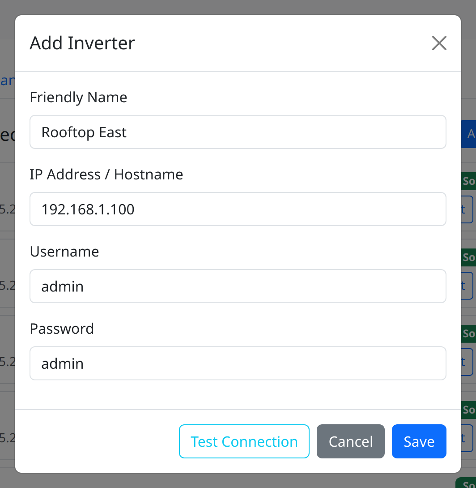

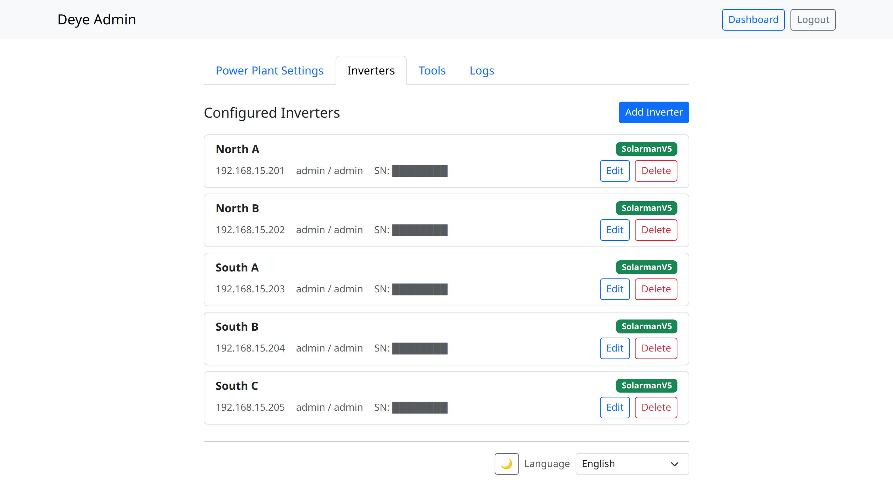

**Editing an inverter**

Click **Edit** on any inverter card to update its name, IP address, or credentials. The SolarmanV5 detection runs again on save.

**Removing an inverter**

Click **Delete** on an inverter card and confirm. Historical data for that inverter is retained in the database.

### 5.5 Tools tab

The Tools tab provides maintenance utilities.

**Fix Incomplete Data**

Scans all historical records and interpolates missing 5-minute data points across every date on record. This is useful if the cron job missed some polling cycles (e.g. after a restart or power cut), leaving gaps in the charts.

Click **Run Fix Incomplete Data** and confirm. A live log streams into the panel as the operation runs. Depending on how much data exists, it may take several minutes. The operation is safe to run at any time and can be run more than once.

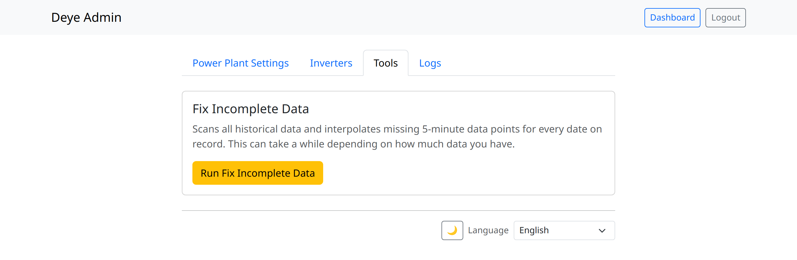

### 5.6 Logs tab

The Logs tab lets you browse and search the application's event log — useful for diagnosing problems without needing to access the container directly.

**Filters available:**

- **Period** — Last 1 hour, 6 hours, 24 hours, 7 days, or a custom date/time range
- **Level** — Filter by severity: `debug`, `info`, `warning`, or `error`
- **Message search** — Free-text search within the log message
- **Context filters** — Add one or more key/value filters to narrow results by structured context fields (e.g. `inverter_sn = 1234567890`)

Click **Search** to load matching entries. Error rows are highlighted in red, warnings in yellow. Each row shows the timestamp, level badge, message, and any structured context attached to the log entry.

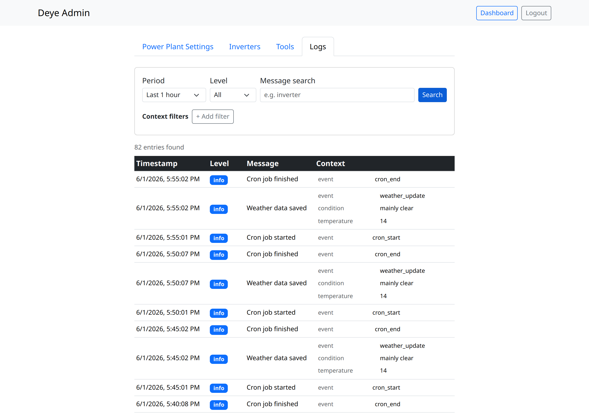

### 5.7 Language and theme

The footer of the admin panel contains two controls that apply across the whole application:

- **Language selector** — changes the UI language for all pages (dashboard, reports, and admin panel). The selection is saved to the database and applies to all browsers accessing the system.
- **Theme toggle** — switches between light and dark mode. The preference is saved per browser in local storage and does not affect other users.

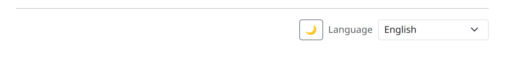

---

## 6. Dashboard

The dashboard is available at `http://<host-ip>:8080/` and is the main page for monitoring your power plant. It refreshes automatically every 60 seconds while showing today's live data.

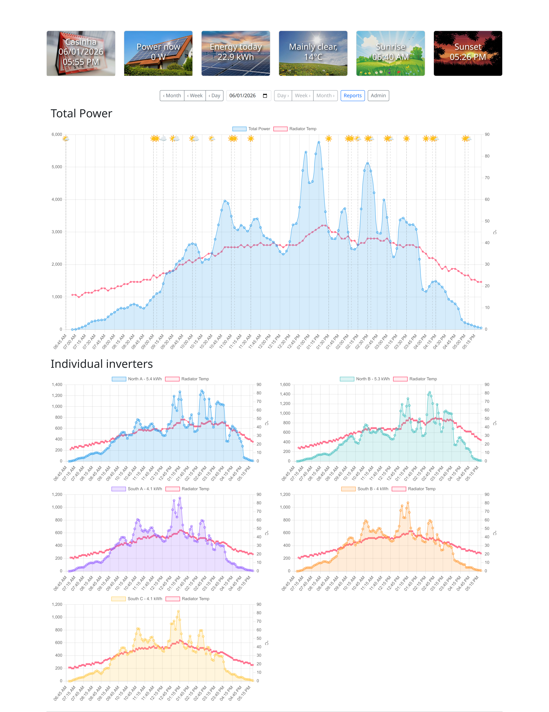

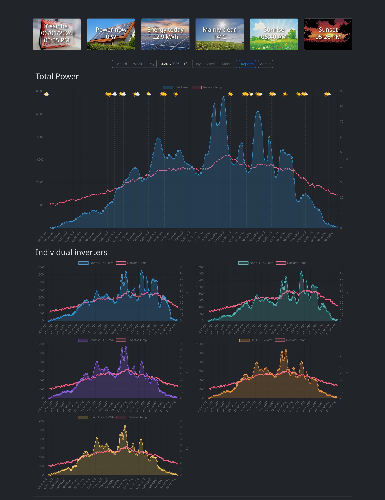

### 6.1 Summary cards

The top row contains six cards showing the most important figures at a glance.

| Card | Live (today) | Historical (past date) |
|------|-------------|----------------------|
| **Plant name / date** | Plant name, current date, and current time | Plant name and the selected date |
| **Power** | Current combined output of all inverters in Watts | Peak power recorded during that day in Watts |
| **Energy** | Total energy produced today in kWh (cumulative since midnight) | Total energy produced on that day in kWh |
| **Weather** | Current weather condition and temperature | Weather condition and temperature at the last recorded reading of that day |
| **Sunrise** | Sunrise time for your configured location | Sunrise time for that date |
| **Sunset** | Sunset time for your configured location | Sunset time for that date |

Sunrise and sunset times are calculated from the latitude and longitude set in the admin panel. They are used by the cron job to decide when to send the daily Telegram report.

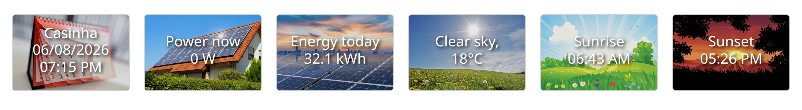

### 6.2 Date navigation

Below the summary cards is a navigation bar for moving between dates.


- **‹ Day / Day ›** — step backward or forward one day at a time
- **‹ Week / Week ›** — jump back or forward 7 days
- **‹ Month / Month ›** — jump back or forward 30 days
- **Date picker** — click to open a calendar and jump directly to any date; future dates and dates before the first recorded data point are disabled
- **● Live** — appears only when viewing a historical date; click to return to today's live view
- **Reports** — shortcut to the Reports page
- **Admin** — shortcut to the Admin Panel

The prev/next buttons are automatically disabled when navigating would go beyond the available data range.

### 6.3 Total Power chart

The main chart shows combined power output across all inverters over the course of the day, plotted as a filled line chart with 5-minute resolution.

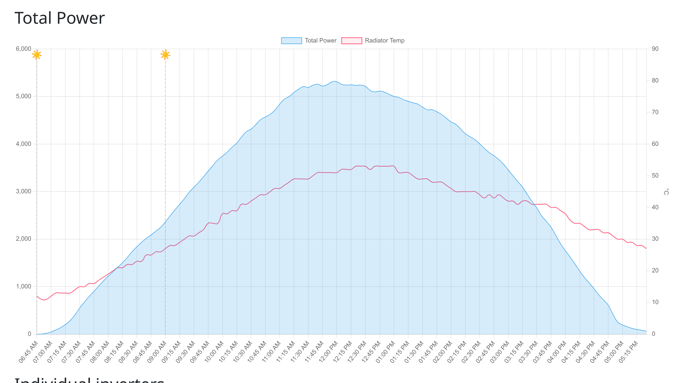

**Left Y-axis (Watts)** — total power being generated at each 5-minute interval.

**Right Y-axis (°C)** — appears only when at least one inverter reports temperature data (SolarmanV5 required). Displays the highest radiator temperature recorded across all inverters at each interval as a separate pink line overlaid on the same chart. The axis is fixed between 0 and 90 °C.

**Weather annotations** — when weather data is available, a dashed vertical line and an emoji icon are drawn on the chart at each moment the weather condition changed during the day. This makes it easy to correlate dips in production with cloud cover or rain. The emoji icons used are:

| Condition | Emoji |
|-----------|-------|
| Clear sky / Mainly clear | ☀️ |
| Partly cloudy | 🌤️ |
| Overcast | ☁️ |
| Fog | 🌫️ |
| Rain / Drizzle / Shower | 🌧️ |
| Thunderstorm | ⛈️ |
| Snow | ❄️ |

### 6.4 Individual inverter charts

Below the Total Power chart there is one chart per configured inverter, laid out in a two-column grid. Each chart shows power output over the day scoped to that inverter. For inverters polled via SolarmanV5, the chart also displays a stacked per-PV-input breakdown: each of the connected panels (PV1–PV4) is drawn as a filled area, making it easy to see how much each panel contributes to the total at any point in the day. The radiator temperature overlay is shown as a line on a separate right axis when available.

The chart title includes the inverter's friendly name, its serial number, and the total energy produced that day (e.g. `Rooftop East (1234567890) — 3.2 kWh`). Each inverter is assigned a distinct colour so the charts are easy to tell apart when comparing multiple inverters side by side.

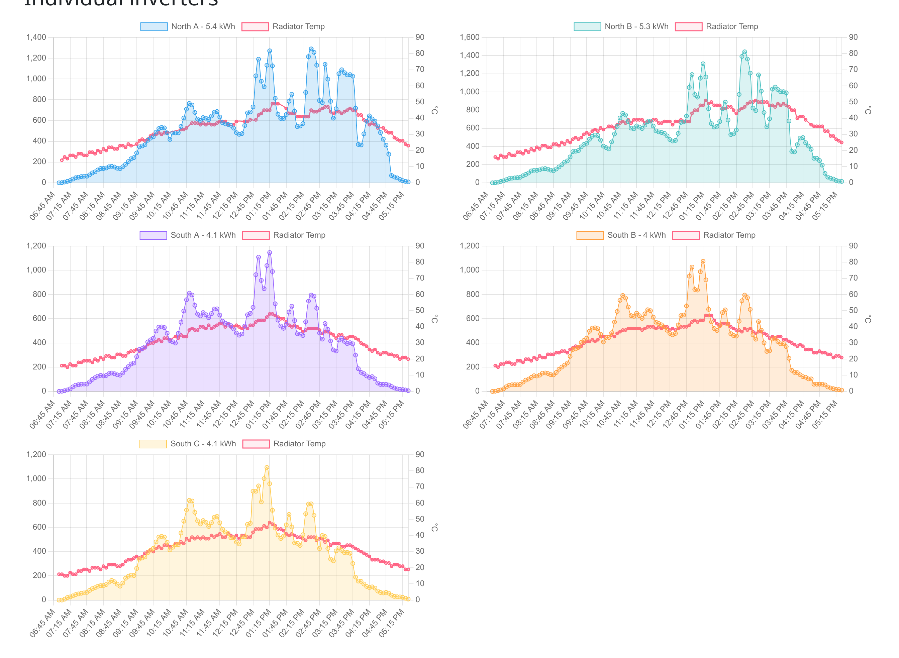

### 6.5 Dark mode

Click the theme toggle button (🌙 / ☀️) in the bottom-right footer to switch between light and dark mode. The preference is saved in your browser's local storage and persists across sessions. It does not affect other browsers or other users accessing the dashboard.

The dashboard also respects your operating system's preferred colour scheme on first load — if your OS is set to dark mode and you have never manually toggled the theme, the dashboard will open in dark mode automatically.

---

## 7. Reports

The Reports page is available at `http://<host-ip>:8080/reports.html` and is also reachable via the **Reports** shortcut in the dashboard navigation bar. It lets you analyse historical production data across arbitrary date ranges, with optional comparison between two periods.

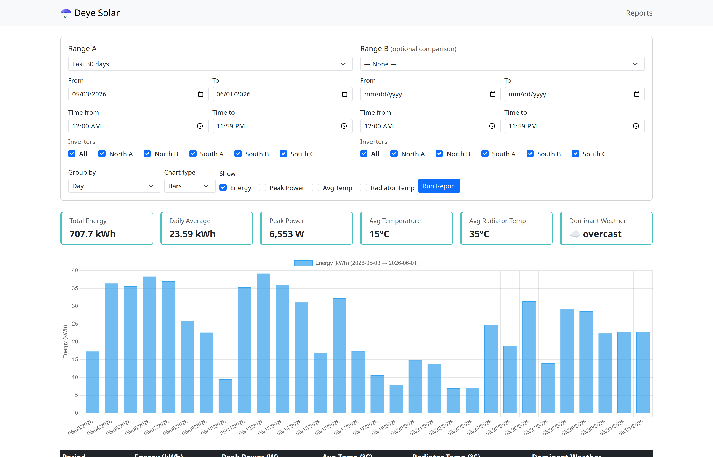

### 7.1 Selecting a date range

The filter panel is split into two columns: **Range A** (required) and **Range B** (optional comparison).

**Using presets**

Each range has a preset dropdown that fills the date fields automatically. The presets are organised into groups:

| Group | Available presets |
|-------|-----------------|
| Days | Today, Yesterday, Day before yesterday |
| Rolling | Last 7 days, Last 30 days, Last 90 days, Last 365 days |
| Calendar | This month, Last month, Month before last, This year (YTD), Last year (YTD), Last full year |
| Quarters | Q1–Q4 for the current and previous two calendar years |
| Seasons | Spring, Summer, Autumn, Winter for the current and previous two years (hemisphere-aware — the season dates are adjusted automatically based on your configured latitude) |

When you select a preset in Range A, Range B is automatically pre-filled with the same period shifted back by one year — for example, selecting "Last 30 days" will suggest "Last 30 days (previous year)" in Range B. You can clear or override Range B at any time.

**Using custom dates**

Click the date fields in either range to enter any start and end date. Selecting custom dates clears the preset selection.

### 7.2 Time-of-day filters

Both Range A and Range B have independent **Time from** and **Time to** fields. These restrict the data within each date range to a specific window of hours — for example, setting Time from `08:00` and Time to `12:00` includes only the morning production readings on every day in the range.

The default is `00:00` to `23:59` (full day). Time-of-day filters are most useful with the **Morning and Afternoon** group-by or when comparing production in a specific part of the day across seasons.

### 7.3 Group by

The **Group by** selector controls how data points are bucketed before being displayed in the chart and table.

| Option | Result | Typical use |
|--------|--------|------------|
| **None** | One row per 5-minute poll cycle | Detailed view of a single day |
| **Hour** | Up to 24 rows, one per hour of the day (aggregated across all days in the range) | Understanding which hours generate the most energy |
| **Morning and Afternoon** | Exactly 2 rows: before noon and after noon (aggregated across the range) | Comparing AM vs PM production |
| **Day** | One row per calendar day | Standard daily production view (default) |
| **Week** | One row per calendar week | Weekly production trends |
| **Month** | One row per calendar month | Monthly totals and year-over-year comparison |
| **Year** | One row per calendar year | Long-term production history |
| **Per PV Input** | One row per panel (PV1–PV4) aggregated across the range | Comparing individual panel performance (SolarmanV5 only) |

> **Performance note:** Using **None** (no grouping) on a range longer than 7 days can be slow, as it returns one row for every 5-minute interval across the entire range. A warning appears in the filter panel if you choose this combination. For long ranges, use Day grouping or higher.

### 7.4 Chart display options

The **Show** checkboxes control which data series appear in the chart:

| Checkbox | What it plots |
|----------|--------------|
| **Energy** | Energy produced per period in kWh (left axis) |
| **Peak Power** | Highest combined power reading within each period in Watts (left axis, line) |
| **Avg Temp** | Average ambient air temperature per period in °C (right axis, line) |
| **Radiator Temp** | Average inverter radiator temperature per period in °C (right axis, line) — only available for SolarmanV5 inverters |

The **Chart type** selector switches between **Bars**, **Lines**, and **Doughnut**. Bars and Lines support dual Y-axes (energy/power on the left, temperature on the right). Doughnut charts show energy only and are most useful with a small number of periods such as months or seasons.

### 7.5 Inverter selection

If you have more than one inverter configured, a set of checkboxes appears below the date fields for each range, allowing you to include or exclude specific inverters. By default all inverters are included.

Range A and Range B have independent inverter selections — you can, for example, compare one inverter against another over the same time period by putting the same dates in both ranges but selecting different inverters.

### 7.6 Running a report

Once you have set the date range, group, and chart options, click **Run Report**. A loading indicator appears while the data is fetched. The report renders in three sections below the filter panel:

**Summary cards** — six cards showing totals and averages across the full range:

| Card | Description |
|------|-------------|
| Total Energy | Sum of all energy produced in the range (kWh) |
| Daily Average | Total energy divided by the number of days in the range (kWh/day) |
| Peak Power | Highest combined instantaneous power reading in the range (W) |
| Avg Temp | Average ambient air temperature across the range (°C) — shown as `—` if no weather data |
| Avg Radiator Temp | Average inverter temperature across the range (°C) — shown as `—` if not available |
| Dominant Weather | Most frequently recorded weather condition in the range |

When Range B is configured, each card shows the A and B values side by side, plus a percentage delta indicating how Range A compares to Range B. Energy and power deltas are colour-coded: green for A higher than B, red for A lower than B. Temperature deltas are shown as a plain numeric difference (no colour).

**Chart** — a visual representation of the selected data series over the period, using the chosen chart type.

**Data table** — a row-by-row breakdown of the same data shown in the chart, including period label, energy (kWh), peak power (W), average temperature, average radiator temperature, and dominant weather condition for each period. When Range B is active, each row shows both A and B values and a per-row energy delta.

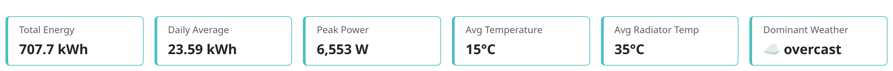

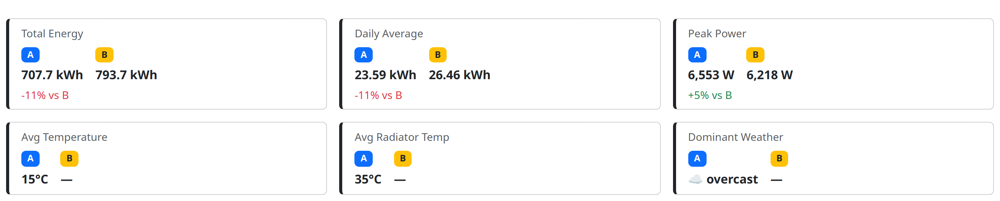

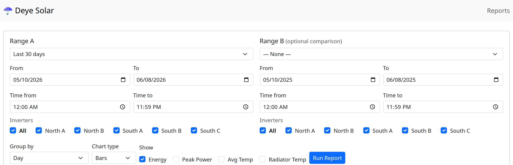

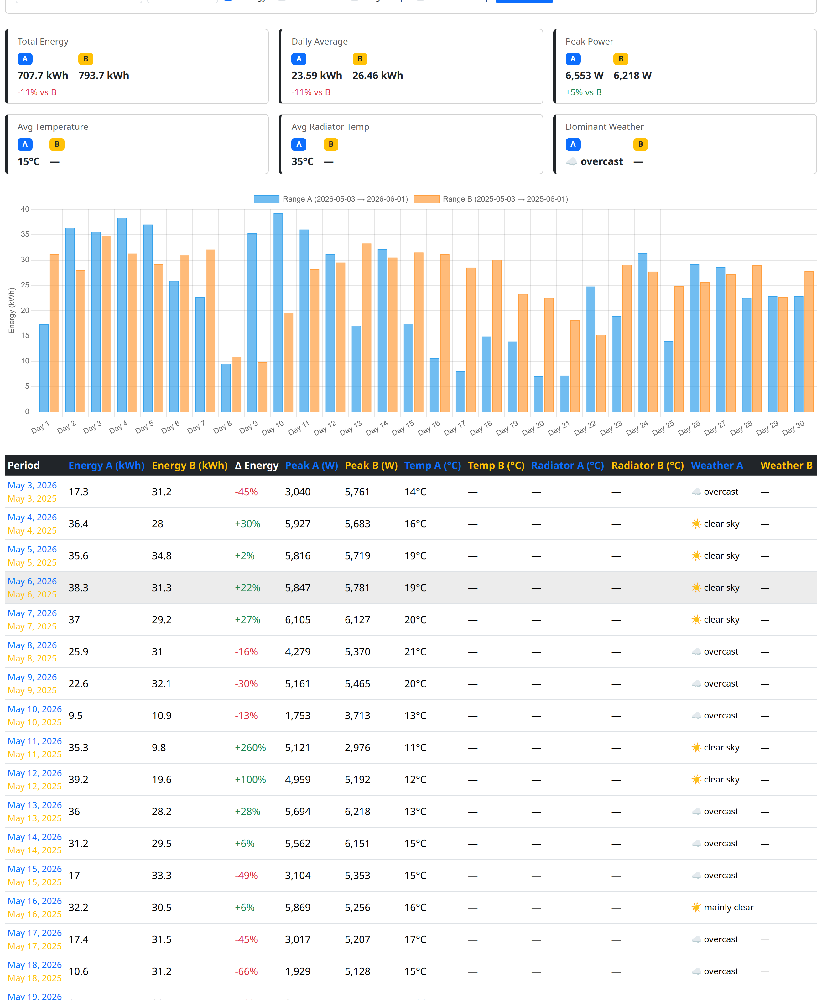

---

## 8. Notifications and Daily Reports

The system can send an automatic daily production report to a Telegram chat at the end of each day. Setup requires a Telegram bot and is done from the admin panel — see sections 3.5 and 5.3 for the configuration steps.

### 8.1 The daily report

The report is sent automatically once per day, triggered at **sunset** (calculated from your configured latitude and longitude). The cron job checks every 5 minutes; the report is sent during the first 5-minute window that falls at or after sunset.

Each daily report consists of:

- **A chart image** — a full-resolution PNG showing combined power output across the day (same data as the Total Power chart on the dashboard), with the radiator temperature overlay if available and weather condition annotations at each condition change.
- **A text caption** including:
  - Total energy generated today (kWh)
  - A new daily record announcement (🏆) if today's production exceeded the previous best
  - On the last day of each month: the total energy for the month, and a new monthly record announcement if applicable

> *[Screenshot needed: Telegram chat showing a received daily report with the chart image and caption]*

### 8.2 When reports are not sent

The report is only sent when Telegram is configured (both bot token and chat ID must be set in the admin panel). If either value is missing or invalid, the cron job skips the Telegram step silently — data collection is unaffected.

If the host machine has no internet access, the Telegram API call will fail. The cron job does not retry; the next report attempt is the following day at sunset.

### 8.3 Setting up Telegram

If you skipped Telegram setup during installation, you can enable it at any time from the admin panel's **Settings** tab (section 5.3).

**Step 1 — Create a bot**

1. Open Telegram and search for `@BotFather`
2. Send `/newbot` and follow the prompts to choose a name and username for the bot
3. BotFather replies with a **bot token** — a string like `123456789:ABCdefGhIJKlmNoPQRsTUVwxyZ`. Copy it.

**Step 2 — Add the bot to your chat**

- For a **personal chat**: open the bot in Telegram and send it any message (e.g. `/start`).
- For a **group chat**: add the bot as a member of the group and send any message mentioning it or to the group.

**Step 3 — Configure in the admin panel**

1. Go to the admin panel → **Settings** tab
2. Paste the bot token into the **Telegram Bot Token** field
3. Click **Detect Chat ID** — the system queries the Telegram API for recent messages to the bot and fills the Chat ID field automatically
4. Click **Send Test Message** to confirm the configuration is working
5. Click **Save Settings**

> **Tip:** If **Detect Chat ID** finds no chat, make sure you have sent at least one message to the bot (or to the group) after adding the bot, then try again.

---

## 9. Understanding Your Data

### 9.1 Power vs Energy

These two terms are often confused but measure different things.

**Power (Watts, W)** is an instantaneous measurement — it tells you how much electricity your inverters are generating *right now*, at this moment. It goes up and down throughout the day as sunlight intensity changes.

**Energy (kilowatt-hours, kWh)** is an accumulated measurement — it tells you how much electricity has been generated over a period of time. Energy Today accumulates from midnight onwards and resets each day. Energy Total is the running lifetime sum since the inverter was first installed.

A simple analogy: power is like speed (how fast you are going), energy is like distance (how far you have travelled total).

In the dashboard:

| Field | What it means |
|-------|--------------|
| Power Now | Combined output of all inverters at the last poll cycle (updated every 5 minutes) |
| Energy Today | Combined kWh produced today across all inverters since midnight |
| Peak Power | (Historical view only) The highest combined power reading recorded on that day |
| Energy Produced | (Historical view only) Total kWh produced on that day |

### 9.2 Inverter radiator temperature

The radiator temperature is the heat-sink temperature measured inside the inverter. It is only available for inverters polled via the SolarmanV5 protocol; it appears as a pink overlay line on the power charts.

**What is normal:** temperature rises gradually as output increases during the morning, peaks around midday, and falls as the afternoon production drops. A reading in the range of 30–65 °C during full production is typical and not a concern.

**When to pay attention:** sustained readings above 70–75 °C, or a temperature that keeps climbing after production has dropped, may indicate insufficient ventilation around the inverter. Ensure the installation location has adequate airflow and is not in direct sunlight.

**In historical charts:** the temperature overlay is shown for all past dates, making it easy to correlate unusually high temperatures with specific weather conditions or production spikes.

### 9.3 Per-panel data (PV inputs)

When polled via SolarmanV5, the inverter reports data for each individual solar panel connected to it. This data is stored in the database and is available in the Reports page via the **Per PV Input** group-by option, which aggregates energy and peak power per panel across the selected date range and supports A/B range comparison.

Each PV input reports:

| Field | Unit | Description |
|-------|------|-------------|
| Voltage | V | Voltage across the panel's terminals |
| Current | A | Current flowing from the panel |
| Power | W | Instantaneous power output (Voltage × Current) |
| Energy Today | kWh | Energy produced by this panel since midnight |
| Energy Total | kWh | Lifetime energy produced by this panel *(not yet available for PV3/PV4 on some models)* |

**Spotting an underperforming panel:** on a clear day, all panels of the same type and orientation should produce similar voltage and power readings. A panel with noticeably lower voltage or near-zero current while its neighbours are producing normally may be shaded, dirty, or have a failing connection.

**Panels with zero voltage** are not stored — if a panel input is unused (not connected to a physical panel), its readings are omitted from the database entirely.

### 9.4 Weather data

Weather data is fetched from the [Open-Meteo](https://open-meteo.com/) API every 5 minutes alongside inverter polling. No account or API key is required. Open-Meteo uses your configured latitude and longitude to return local forecast data.

The following fields are recorded at each poll cycle:

| Field | Description |
|-------|-------------|
| Condition | A text description based on WMO weather codes (e.g. "Clear sky", "Partly cloudy", "Rain shower") |
| Temperature | Ambient air temperature in °C |
| Humidity | Relative humidity in % |
| Wind speed | Wind speed in km/h |
| Wind direction | Wind direction in degrees |

**How weather relates to production:** cloud cover is the dominant factor. A partly cloudy day can cut production by 30–50% compared to a clear day of similar length. Rain and overcast conditions can reduce it by 70–90%. The weather condition annotations on the Total Power chart (section 6.3) make these correlations visible at a glance.

**No internet access:** if the host machine cannot reach the Open-Meteo API, weather data simply will not be recorded. Inverter polling and data collection continue normally — weather is supplementary.

### 9.5 Gap-filled data points

The cron job runs every 5 minutes. If a poll cycle is missed — because the host machine was restarting, the containers were updating, or there was a brief network issue — that 5-minute slot will be empty in the database, showing as a gap in the charts.

The **Fix Incomplete Data** tool in the admin panel (section 5.5) fills these gaps by interpolating missing values between the surrounding real data points. Gap-filled rows are flagged in the database and have no per-panel data attached — they smooth the chart visually but do not represent actual measurements.

Gap-filled points are not distinguishable from real points in the current charts. They have no effect on energy totals, which are read directly from the inverter and reflect actual production regardless of gaps in the time-series.

---

## 10. Backup and Restore

All historical production data is stored in the PostgreSQL database. The application includes an automatic backup system and a restore script so you can protect that data and recover from failures.

### 10.1 Automatic backups

A backup runs automatically every day at **02:00** (host machine local time). It is executed by the `deye_cron` container using a built-in cron job.

Each backup is a gzip-compressed PostgreSQL dump. Backups are stored in the `./backups/` directory on the host machine (the directory that was created when you cloned the repository). The `deye_cron` container mounts this directory, so the files are accessible directly on the host even when the container is not running.

**File naming:** `deye_backup_YYYYMMDD_HHMMSS.sql.gz`

**Retention:** Backups older than 7 days are deleted automatically after each new backup is written. At most 7 daily backups are kept at any time.

**What is included:** the entire database — all inverter records, all time-series power data, all weather data, all settings, and all user accounts.

**What is not included:** application code, `docker-compose.yml`, and any customisations you have made to those files. These are tracked by git and can be restored with `git pull` or by re-cloning the repository.

### 10.2 Manually triggering a backup

You can trigger a backup at any time by running the backup script inside the `deye_cron` container:

```bash
docker compose exec deye_cron /usr/local/bin/backup.sh
```

The resulting file is written to `./backups/` on the host, just like an automatic backup.

### 10.3 Verifying your backups

To list the backup files currently on disk:

```bash
ls -lh ./backups/
```

To confirm a file is a valid gzip-compressed SQL dump:

```bash
gunzip -t ./backups/deye_backup_YYYYMMDD_HHMMSS.sql.gz && echo "OK"
```

### 10.4 Restoring from a backup

> **Warning:** Restoring replaces all current data in the database. Make sure you have the correct backup file before proceeding.

The `restore.sh` script handles the full restore process. Run it from the project directory on the host machine (not inside a container):

```bash
bash restore.sh
```

With no arguments, it selects the **most recent** backup file from `./backups/` automatically and asks for confirmation before proceeding.

To restore from a specific file:

```bash
bash restore.sh ./backups/deye_backup_20250101_020001.sql.gz
```

The script:
1. Prints the backup file it will use and asks you to confirm (`y/N`)
2. Stops the `deye_php` and `deye_cron` containers
3. Drops and recreates the database
4. Loads the backup into the fresh database
5. Restarts both containers

Once complete, the dashboard and all historical data are available as they were at the time of the backup.

> **Tip:** If the restore fails partway through (e.g. a corrupted backup file), the containers are left stopped. Run `docker compose start deye_php deye_cron` to bring them back up, then try with a different backup file.

---

## 11. Updating

Updates to the application are distributed via git. The process takes about two minutes and preserves all existing data.

### 11.1 Pull the latest code

From the project directory on the host machine, fetch and apply the latest changes:

```bash
git pull
```

If you have made local changes to any tracked files (such as `docker-compose.yml`), git may report a conflict. Either stash your changes first (`git stash`) or resolve the conflict manually before pulling.

### 11.2 Rebuild and restart the stack

After pulling, rebuild the PHP container image and restart all services:

```bash
bash rebuild.sh
```

This is equivalent to `docker compose down` followed by `docker compose up -d --build`. The script suppresses most output — if you want to see the full build log, run the commands manually:

```bash
docker compose down
docker compose up -d --build
```

The database container (`deye_db`) is not rebuilt — it uses the official PostgreSQL image pulled from Docker Hub. Only the `deye_php` and `deye_cron` images are rebuilt from the local Dockerfiles.

### 11.3 Your data is preserved

All production data lives in a **named Docker volume** (`pgdata`) that is managed separately from the container images. Rebuilding or removing the containers does not touch this volume, so no historical data is lost during an update.

The only way to lose data is to explicitly delete the volume (`docker volume rm deye-local-api-and-dashboard_pgdata`) or to run `docker compose down -v`, which removes all volumes. Do not use `-v` unless you intend to wipe the database.

### 11.4 Schema migrations

When the `deye_php` container starts, it runs `setup_db()` automatically. This function creates any tables, indexes, or columns that are missing and applies any schema changes needed to bring an older installation up to date. You do not need to run any migration commands manually — simply rebuilding the stack is sufficient.

### 11.5 If something breaks after an update

Check the container logs for error messages:

```bash
docker compose logs deye_php
docker compose logs deye_cron
```

The PHP container log shows startup errors and any PHP warnings or fatal errors encountered during web requests. The cron container log shows the output of each 5-minute poll cycle and the backup job.

If the dashboard is inaccessible but the containers appear to be running (`docker compose ps` shows all three as `Up`), open `http://<host-ip>:8080/` in a browser and check the browser console for JavaScript errors, or curl the API directly:

```bash
curl -s http://localhost:8080/overall.php | head -c 500
```

If an update introduced a regression you cannot diagnose, you can roll back to the previous commit:

```bash
git log --oneline -5    # find the commit hash before the update
git checkout <hash>     # check out that version
bash rebuild.sh
```

Restore your data from a backup if the schema changed in a way that is incompatible with the older code.

---

## 12. Troubleshooting

### 12.1 Reading container logs

Before diving into specific problems, it helps to know how to read the application logs. Each service writes to its own log stream:

```bash
docker compose logs deye_php    # Web server: dashboard, API, admin panel
docker compose logs deye_cron   # Data collection and Telegram reports
docker compose logs deye_db     # PostgreSQL database
```

Add `-f` to follow the log in real time:

```bash
docker compose logs -f deye_cron
```

The application also has a structured event log browsable from the admin panel's **Logs** tab (section 5.6), which is often faster than reading raw container output.

---

### 12.2 Dashboard shows no data or charts are empty

**Check that all containers are running:**

```bash
docker compose ps
```

All three services (`deye_php`, `deye_db`, `deye_cron`) should show a status of `Up`. If any is stopped or restarting, check its logs.

**Check if data collection is running:**

```bash
docker compose logs deye_cron
```

Look for lines like `Cron job started` and `Cron job finished`. If there are none, or if you see connection errors, the cron container cannot reach the inverter or the database.

**Check that at least one inverter is configured:**

Open the admin panel → **Inverters** tab. If the list is empty, no data can be collected. Follow section 5.4 to add an inverter.

**Check that it is daylight:**

The cron job skips polling outside of daylight hours (more than 10 minutes before sunrise or after sunset). If you are checking during the night, the empty chart is normal — try again after sunrise.

**Check the earliest available date:**

The date navigation buttons in the dashboard prevent navigation before the first recorded data point. If you just installed the system, there may be no historical data yet. Wait for the first full day of collection.

---

### 12.3 Inverter is not being polled

**Verify the inverter is reachable from the host machine:**

```bash
ping -c 4 <inverter-ip>
curl -u admin:admin http://<inverter-ip>/status.html
```

If ping works but curl fails, the inverter may have non-default credentials. If ping itself fails, check that the host machine and the inverter are on the same network segment and that no firewall is blocking ICMP.

**Check the Logs tab in the admin panel:**

Filter by level `error` or `warning`. Look for messages referencing the inverter serial number or IP address. A repeated `Failed to fetch inverter data` message with an HTTP error code confirms the HTTP polling is failing. A `SolarmanV5 poll failed, falling back to HTTP` warning indicates the primary protocol is unavailable.

**SolarmanV5 not working (TCP port 8899 blocked):**

Some network configurations block port 8899 between the host machine and the inverter's Wi-Fi chip. If the Logs tab shows SolarmanV5 failures, check your router's firewall or VLAN isolation settings. If you cannot open port 8899, the system will automatically fall back to HTTP polling — you just lose temperature and per-panel data. There is no configuration change required for the fallback to take effect.

**HTTP fallback failing:**

If both protocols fail, confirm the IP address is still correct (inverters can get a new DHCP lease after a reboot if a static reservation was not set). Update the IP address in the admin panel → **Inverters** tab → **Edit**. Section 3.2 explains how to set up a permanent DHCP reservation to prevent this from recurring.

---

### 12.4 Wrong timezone on charts or incorrect daily totals

The application calculates all timestamps — chart x-axes, energy-today resets, sunrise/sunset — in the plant's configured timezone. If the charts show the wrong time of day, or if daily energy totals reset at midnight UTC instead of midnight local time, the timezone is not set correctly.

**Fix it in the admin panel:**

Go to **Settings** tab → **Timezone** dropdown. Select your correct local timezone (e.g. `Europe/Lisbon`, `America/Sao_Paulo`). Click **Save Settings**.

Changes take effect immediately for new data. Existing data in the database is stored as UTC timestamps and is re-interpreted in the new timezone on the next request, so historical charts will also correct themselves.

---

### 12.5 Telegram reports not being sent

**Verify the configuration:**

Go to the admin panel → **Settings** tab. Both the **Telegram Bot Token** and **Telegram Chat ID** fields must be filled. Click **Send Test Message** — if you receive the test in Telegram, the configuration is correct and the issue is with the report trigger logic. If the test fails, the token or chat ID is wrong.

**The report is timed to sunset:**

The daily report is only sent once per day during the 5-minute cron window at or just after sunset (section 8.1). If the test message works but the daily report is not arriving, check that the timezone and coordinates in the admin panel are correct — an incorrect timezone or location will shift the calculated sunset time.

**Check for errors in the cron log:**

```bash
docker compose logs deye_cron | grep -i telegram
```

**Check internet access from the cron container:**

```bash
docker compose exec deye_cron curl -s https://api.telegram.org/ | head -c 100
```

If this returns an error, the container cannot reach the Telegram API. Check the host machine's outbound internet access.

---

### 12.6 Database container fails to start

**Check for a port conflict:**

The database container exposes port 5442 on the host. If another process is using that port, the container will fail to bind.

```bash
ss -tlnp | grep 5442
```

If the port is in use, change the host port in `docker-compose.yml` (e.g. `"5443:5432"`) and rebuild.

**Check the database logs:**

```bash
docker compose logs deye_db
```

A common error is a corrupted data directory. If the logs show `database system identifier differs` or similar, the volume may have been initialised with a different PostgreSQL version. In that case, restore from a backup (section 10.4) after wiping the volume.

**Check volume permissions:**

```bash
docker volume inspect deye-local-api-and-dashboard_pgdata
```

The `Mountpoint` path on the host should be readable by the Docker daemon. Permission issues here are uncommon with standard Docker Engine installations.

---

### 12.7 Admin panel login does not work

**Clear the stored session:**

The admin panel stores the authentication token in your browser's local storage. If the token has become invalid (e.g. after a database restore), the login form may appear to succeed but then fail silently.

Open your browser's developer tools, go to **Application → Local Storage**, find the entry for the admin panel URL, and delete all entries starting with `deye_`. Reload the page and log in again.

**Forgot your admin password:**

There is currently no password reset flow in the UI. You can reset the admin account directly in the database:

```bash
docker compose exec deye_db psql -U deye_db_user deye_data \
  -c "UPDATE admin_users SET password_hash = md5('newpassword') WHERE username = 'admin';"
```

Replace `newpassword` with the new password and `admin` with the username. Log in with the new credentials immediately after.

---

### 12.8 The cron job runs but produces no new data

**Check whether it is outside daylight hours:**

As described in section 12.2, polling is intentionally skipped before sunrise and after sunset. This is normal behaviour and not a bug.

**Check the 5-minute interval:**

The cron runs every 5 minutes. If you just started the stack, wait up to 5 minutes for the first poll to complete.

**Check for PHP errors:**

```bash
docker compose logs deye_php | tail -50
```

If `crontasks.php` throws a PHP fatal error, the cron container will silently succeed (the HTTP request completes) but no data will be written. Look for `Fatal error` or `PHP Warning` lines.

---

## 13. API Reference

The application exposes three JSON endpoints that you can query from any application on your local network. All three return `Content-Type: application/json`.

### 13.1 Authentication

The data endpoints (`overall.php`, `reports.php`, `deye.php`) have **no authentication**. Any client on your local network that can reach the host machine on port 8080 can call them. Do not expose port 8080 to the public internet unless you add authentication at the network level (e.g. a reverse proxy with basic auth).

The admin panel API (`/admin/api.php`) uses Bearer token authentication managed by the admin panel's login system. It is not intended for third-party use.

---

### 13.2 `overall.php` — aggregated plant data

Returns the current (or historical) state of the entire power plant, including chart-resolution time-series data for the day. This is the endpoint the dashboard calls every 60 seconds.

**URL:** `GET http://<host-ip>:8080/overall.php`

**Query parameters:**

| Parameter | Required | Description |
|-----------|----------|-------------|
| `date` | No | `YYYY-MM-DD` — return historical data for this date instead of today |

**Example requests:**

```
GET http://192.168.1.50:8080/overall.php
GET http://192.168.1.50:8080/overall.php?date=2025-06-01
```

**Response fields:**

| Field | Type | Description |
|-------|------|-------------|
| `powerplant_name` | string | Plant name from admin panel settings |
| `powerplant_timezone` | string | Plant timezone (IANA format, e.g. `Europe/Lisbon`) |
| `timestamp` | string | Server time at the moment the request was processed (ISO 8601 with offset) |
| `reference_date` | string | The date the response data is for (ISO 8601 with offset) |
| `is_historical` | boolean | `true` when the `?date=` parameter was used and the date is in the past |
| `min_date` | string | Earliest date for which data exists in the database (`YYYY-MM-DD`) |
| `sunrise` | string | Sunrise time for the reference date (ISO 8601 UTC) |
| `sunset` | string | Sunset time for the reference date (ISO 8601 UTC) |
| `total_power_now` | number | Combined current output of all inverters in Watts (live only; `0` in historical mode) |
| `total_energy_today` | number | Combined energy produced on the reference date in kWh |
| `total_energy_total` | number | Combined lifetime energy across all inverters in kWh |
| `peak_power_now` | number | Highest combined power reading during the reference date in Watts (historical only; `0` in live mode) |
| `latest_inverter_data` | array | One object per inverter with the most recent poll result for the reference date |
| `detailed_inverter_data` | array | Per-inverter time-series at 5-minute resolution between sunrise and sunset |
| `detailed_powerplant_data` | array | Combined plant time-series (sum across all inverters) at 5-minute resolution |
| `latest_weather_data` | object or null | Current weather condition and temperature, or null if unavailable |
| `weather_changes` | array | Each weather condition transition during the day, used for chart annotations |

Each object in `latest_inverter_data` contains: `id`, `device_sn`, `power_now`, `energy_today`, `energy_total`, `radiator_temp` (null if not available), `created_at` (UTC), `created_at_local` (plant timezone), `friendly_name`.

Each object in `detailed_powerplant_data` contains: `time` (ISO 8601 UTC), `total_power_now`, `max_radiator_temp`.

Each object in `weather_changes` contains: `time` (ISO 8601 UTC), `condition` (text description).

**Error responses:**

| HTTP code | Condition |
|-----------|-----------|
| 400 | `date` parameter has invalid format or is a future date |

---

### 13.3 `reports.php` — historical aggregated reports

Returns aggregated production data for one or two date ranges, with optional grouping. This is the endpoint the Reports page uses.

**URL:** `GET http://<host-ip>:8080/reports.php`

#### Config action

```
GET http://192.168.1.50:8080/reports.php?action=config
```

Returns: `{ "latitude": -23.5, "timezone": "America/Sao_Paulo", "inverters": [{"device_sn": "...", "friendly_name": "..."}] }`

#### Report action (default)

**Range A parameters (required):**

| Parameter | Description |
|-----------|-------------|
| `a_from` | Start date for Range A (`YYYY-MM-DD`) |
| `a_to` | End date for Range A (`YYYY-MM-DD`) |
| `a_time_from` | Start of time-of-day window for Range A (`HH:MM`; default `00:00`) |
| `a_time_to` | End of time-of-day window for Range A (`HH:MM`; default `23:59`) |
| `a_inverters` | Comma-separated list of `device_sn` values to include (omit for all inverters) |

**Range B parameters (optional — include all or none):**

| Parameter | Description |
|-----------|-------------|
| `b_from` | Start date for Range B (`YYYY-MM-DD`) |
| `b_to` | End date for Range B (`YYYY-MM-DD`) |
| `b_time_from` | Start of time-of-day window for Range B (`HH:MM`; default `00:00`) |
| `b_time_to` | End of time-of-day window for Range B (`HH:MM`; default `23:59`) |
| `b_inverters` | Comma-separated list of `device_sn` values for Range B |

**Grouping:**

| Parameter | Values | Default |
|-----------|--------|---------|
| `group` | `none`, `hour`, `halfday`, `day`, `week`, `month`, `year` | `day` |

**Example:**

```
GET http://192.168.1.50:8080/reports.php?a_from=2025-01-01&a_to=2025-06-30&group=month
```

**Response structure:**

```json
{
  "range_a": {
    "from": "2025-01-01",
    "to": "2025-06-30",
    "group": "month",
    "summary": {
      "total_energy_kwh": 842.5,
      "daily_avg_kwh": 4.6,
      "peak_power_w": 1840,
      "avg_temp": 22,
      "max_radiator_temp": 45,
      "dominant_condition": "Partly cloudy"
    },
    "data": [
      {
        "period_start": "2025-01-01",
        "energy_kwh": "98.40",
        "peak_power_w": "1620",
        "avg_temp": "18",
        "max_radiator_temp": "38",
        "dominant_condition": "Partly cloudy"
      }
    ]
  },
  "range_b": { ... }
}
```

`period_start` format depends on the group: a `YYYY-MM-DD` date for `day`/`week`/`month`/`year`, an `HH:MM` string for `hour`, and the literal string `morning` or `afternoon` for `halfday`. When `group=none`, it is a `YYYY-MM-DD HH:MM` timestamp.

**Error responses:**

| HTTP code | Condition |
|-----------|-----------|
| 400 | Missing or invalid `a_from`/`a_to`, invalid date format, invalid `group` value, invalid time format |

---

### 13.4 `deye.php` — live single-inverter query

Polls a single inverter directly by IP address and returns its current readings. This endpoint does **not** query the database — it fetches live data from the inverter over HTTP at the time of the request using the HTTP Basic Auth method.

> **Note:** This endpoint is useful for one-off queries or testing connectivity. For regular monitoring, `overall.php` is more efficient as it serves data from the database rather than making a live request to the inverter on every call.

**URL:** `GET http://<host-ip>:8080/deye.php`

**Query parameters (all required):**

| Parameter | Description |
|-----------|-------------|
| `ipaddress` | IP address or hostname of the inverter |
| `username` | HTTP Basic Auth username (default: `admin`) |
| `password` | HTTP Basic Auth password (default: `admin`) |

**Example:**

```
GET http://192.168.1.50:8080/deye.php?ipaddress=192.168.1.100&username=admin&password=admin
```

**Success response:**

```json
{
  "inverter_sn": "1234567890",
  "power_now": 423.0,
  "energy_today": 2.3,
  "energy_total": 1042.7,
  "device_sn": "9876543210",
  "device_ver": "MW3_16U_5406_1.53",
  "timestamp": "2025-06-01T14:32:00Z",
  "ipaddress": "192.168.1.100"
}
```

`inverter_sn` is the inverter serial number; `device_sn` is the logger (Wi-Fi stick) serial number. `power_now` is in Watts; `energy_today` and `energy_total` are in kWh.

**Error response (HTTP 500):**

```json
{
  "error": "Could not fetch the status page.",
  "ipaddress": "192.168.1.100",
  "status": 0,
  "timestamp": "2025-06-01T14:32:00Z"
}
```

---

### 13.5 Example integrations

**Home Assistant — REST sensor for current plant power:**

```yaml
sensor:
  - platform: rest
    name: "Solar Power Now"
    resource: http://192.168.1.50:8080/overall.php
    value_template: "{{ value_json.total_power_now }}"
    unit_of_measurement: "W"
    scan_interval: 300
  - platform: rest
    name: "Solar Energy Today"
    resource: http://192.168.1.50:8080/overall.php
    value_template: "{{ value_json.total_energy_today }}"
    unit_of_measurement: "kWh"
    scan_interval: 300
```

**Node-RED — inject current power into a flow:**

Use an HTTP Request node with method `GET` and URL `http://192.168.1.50:8080/overall.php`. Set the output to a parsed JSON object. The `total_power_now` property on the message payload contains the current plant output in Watts.

**Grafana — JSON datasource plugin:**

Install the [Grafana JSON datasource plugin](https://grafana.com/grafana/plugins/simpod-json-datasource/) and point it at `http://192.168.1.50:8080/reports.php`. Use the `reports.php` query parameters to fetch daily or monthly aggregates and map `period_start` to the time axis and `energy_kwh` to the value axis.
